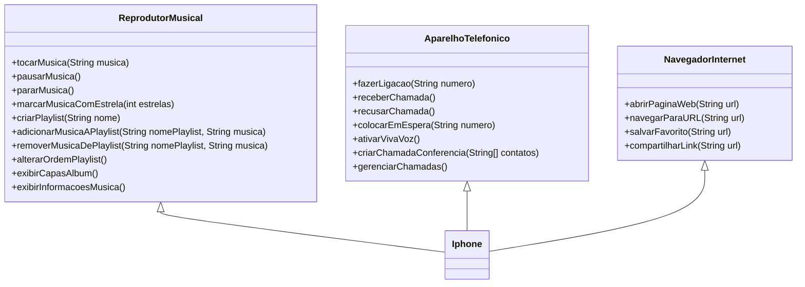

# Diagrama de classe UML de um Iphone

```mermaid
classDiagram

direction TB

class  ReprodutorMusical  {

+tocarMusica(String musica)

+pausarMusica()

+pararMusica()

+marcarMusicaComEstrela(int estrelas)

+criarPlaylist(String nome)

+adicionarMusicaAPlaylist(String nomePlaylist, String musica)

+removerMusicaDePlaylist(String nomePlaylist, String musica)

+alterarOrdemPlaylist()

+exibirCapasAlbum()

+exibirInformacoesMusica()

}

  

class  AparelhoTelefonico  {

+fazerLigacao(String numero)

+receberChamada()

+recusarChamada()

+colocarEmEspera(String numero)

+ativarVivaVoz()

+criarChamadaConferencia(String[] contatos)

+gerenciarChamadas()

}

  

class  NavegadorInternet  {

+abrirPaginaWeb(String url)

+navegarParaURL(String url)

+salvarFavorito(String url)

+compartilharLink(String url)

}
ReprodutorMusical  <|--  Iphone

AparelhoTelefonico  <|--  Iphone

NavegadorInternet  <|--  Iphone
```
